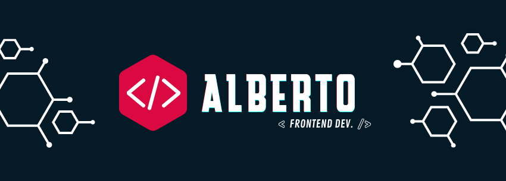

> “O que eu ouço, eu esqueço. O que eu vejo, eu lembro. O que eu faço, eu entendo” – *Confúcio*

# Olá! Eu me chamo Alberto. Prazer em conhecer você!  

<h4 align="center"><a href ="https://portfolio-allbertuu.vercel.app/">Clique aqui para acessar meu portfólio ❤</a></h4>

#### Switch to English: <kbd></kbd>

## 🔖 Sobre mim
Minha história no mundo da programação começa quando eu tinha 16 anos. Eu comecei com minha primeira linguagem de programação no ensino médio, C#. Eu amei como problemas grandes e complexos poderiam ser resolvidos com softwares construídos por mim mesmo. Eu realmente me interessei demais nisso.

Então eu decidi desenvolver código usando em maioria tecnologias Frontend, focado em React e seu ecossistema - NextJS, Redux, Styled-components, hooks, MaterialUI e outras bibliotecas ReactJS e CSS.

- 🔥 Desenvolvedor Frontend React e Desenvolvedor Mobile
- 🎯 Objetivo profissional: ser relevante na área de tecnologia, assim como ser capaz de gerenciar grandes equipes. Pretendo dominar com excelência o JavaScript, e ser referência para outros desenvolvedores.
- 🧩 Modus operandi: viciado em resolver problemas, me pego sempre buscando desafios novos ou antigos para resolver. 
- Meu <a href="https://anilist.co/user/allbertuu/">AniList</a>
- 🎂 Idade: 19 anos

## 🚀 Habilidades principais:

  
  
  
  

 

## 🚀 Outras habilidades:

  
  
  
  
  
  
  
  

 

## 🔄 Estatísticas do GitHub

  

  
**❗ Aviso**  
Minha experiência com uma linguagem nesse painel <strong>não</strong> reflete o meu absoluto aprendizado, tendo em vista que o algoritmo somente se aplica à <mark>meus projetos públicos</mark>.
Meu nível atual em uma linguagem sempre irá variar para cima, nunca para baixo.

  ## 📧 Entre em contato comigo
  

   
    
  

  ### 🍪 Outros links
   
   
 
  ## 💠 Espaço de trabalho

  **IDE:**
    
  **Host preferido:**
    
  **Sistema operacional (SO):**
    
  

<h3>Informações (quase) irrelevantes 🌟</h3>
  1. Meus animes favoritos são: Fullmetal Alchemist e Hunter X Hunter. 
  2. Sou viciado em praticar exercício de manhã cedo 
  3. Planejo, e vou, viajar o mundo 🌎 
