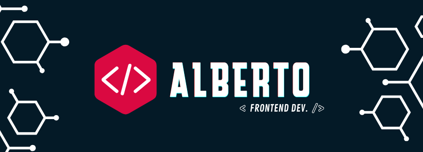

# Olá! Eu me chamo Alberto. Prazer em conhecer você!  

<h4 align="center"><a href ="https://portfolio-allbertuu.vercel.app/">Clique aqui para acessar meu portfólio ❤</a></h4>

#### Switch to English: <kbd></kbd>

## 🔖 Sobre mim
Minha história entrando na programação é rápida, eu diria. E se resume em: ***paixão***. Comecei meus primeiros códigos em C# aos 16 anos, tendo minhas primeiras aulas de programação na vida no colegial. Me apaixonei.  
> Hoje, quase tudo que aprendo advém de uma sede insaciavél de aprender. Atualmente, desenvolvo majoritariamente voltado à tecnologias de Front-end, mas em um futuro não tão distante serei Fullstack.

- 🔥 Desenvolvedor Frontend jr
- 🎯 Objetivo profissional: ser relevante na área de tecnologia, assim como ser capaz de gerenciar grandes equipes, dominar com excelência o JavaScript, e ser referência para outros desenvolvedores.
- 😄 Pronomes: ele/dele
- 🧩 Modus operandi: viciado em resolver problemas, me pego sempre buscando desafios novos ou antigos para resolver. 
- Meu <a href="https://anilist.co/user/allbertuu/">AniList</a>
- 🎂 Idade: 19 anos

## 🚀 Principais habilidades:

  
  
  
  
  
  
  

 

## 🚀 Outros habilidades:

  
  

 

## 🔄 GitHub stats

  

  
**❗ Aviso**  
Minha experiência com uma linguagem nesse painel <strong>não</strong> reflete o meu absoluto aprendizado, tendo em vista que o algoritmo somente se aplica à <mark>meus projetos públicos</mark>.
Meu nível atual em uma linguagem sempre irá variar para cima, nunca para baixo.

  ## 📧 Entre em contato comigo
  

   
    
  

  ### 🍪 Outros links
   
   
 
  ## 💠 Espaço de trabalho

  

    
    
    
    
    
  

  
  #### Sistema operacional (SO):
  

    
  

  

  ##
  

  
Chegou até aqui?
Toma um doce 🍬

<h3>Informações (quase) irrelevantes 🌟</h3>
  1. Meus animes favoritos são: Fullmetal Alchemist e Hunter X Hunter. 
  2. Sou viciado em praticar exercício de manhã cedo 
  3. Planejo, e vou, viajar o mundo 🌠
